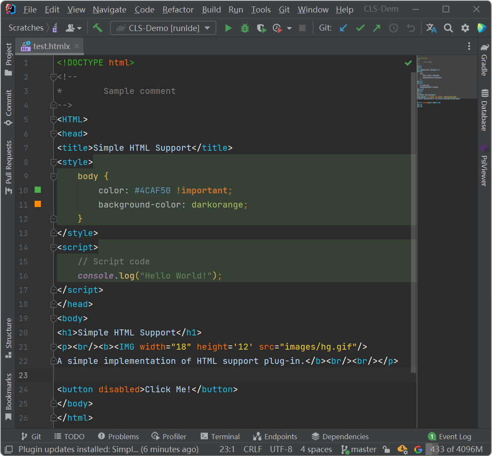

# Custom Language Support Demo

A simple implementation of HTML support plugin for IntelliJ based IDEs.
This plugin parses the content of the `.htmlx` file into HTML code and highlights it.

> Notice: all tags must be closed correctly, unclosed tags will be treated as syntax errors.

The implementation of this plugin refers to [Custom Language Support Tutorial](https://plugins.jetbrains.com/docs/intellij/custom-language-support-tutorial.html).

Completed tasks:

* [x] **1.Prerequisites**
* [x] **2.Language and File Type**
* [x] **3.Grammar and Parser**
* [x] **4.Lexer and Parser Definition**
* [x] **5.Syntax Highlighter and Color Settings Page**
* [x] **6.PSI Helpers and Utilities**
* [x] **7.Annotator**
* [ ] 8.Line Marker Provider
* [x] **9.Completion Contributor**
* [ ] 10.Reference Contributor
* [ ] 11.Find Usages Provider
* [x] **12.Folding Builder**
* [ ] 13.Go To Symbol Contributor
* [x] **14.Structure View Factory**
* [ ] 15.Formatter
* [ ] 16.Code Style Settings
* [x] **17.Commenter**
* [x] **18.Quick Fix**